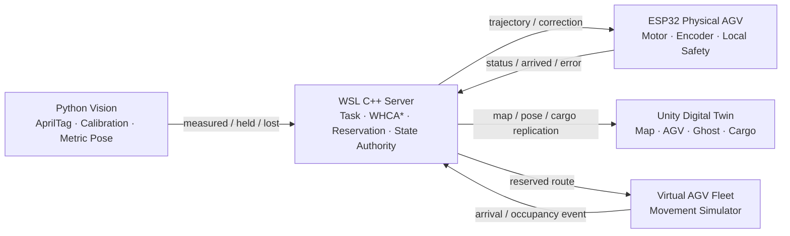
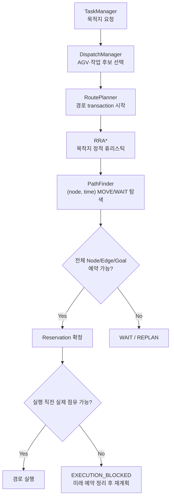
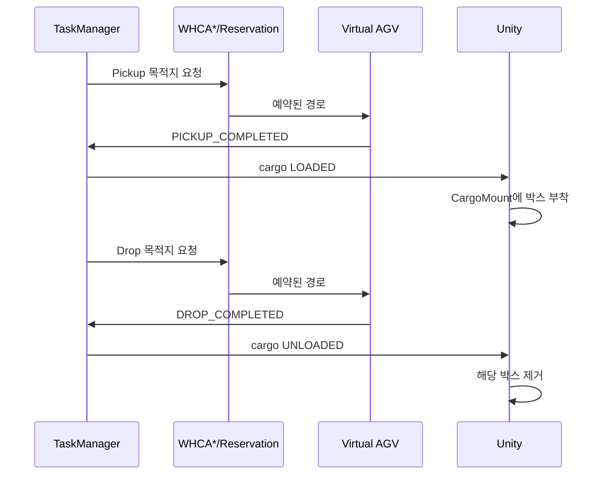
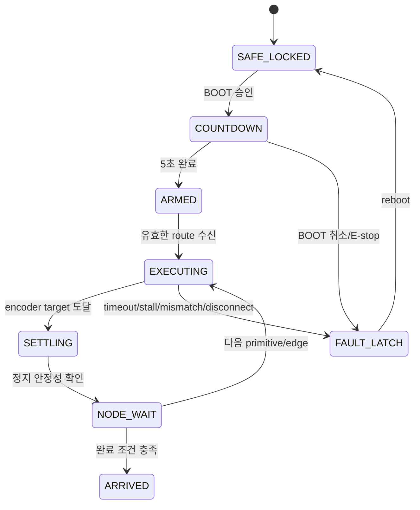
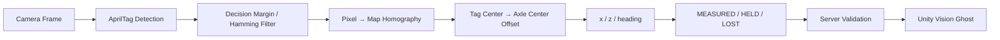
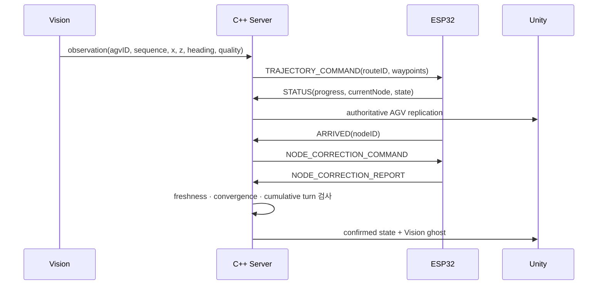

# SmartFactory AGV Digital Twin 포트폴리오 원고

작성 기준: 2026-09-07  
용도: 기존 포트폴리오에 추가할 프로젝트 페이지의 원고·구성·시각 자료 가이드  
권장 분량: 핵심 8페이지 + 선택 2페이지

> 이 문서는 포트폴리오 편집기에 바로 옮길 수 있는 원고다. 아래의 검증 수치는 현재 저장소 문서와 실제 시험 기록에서 확인된 범위만 사용했으며, 여러 대의 실물 AGV 또는 산업 현장 수준의 정밀도를 검증했다는 표현은 사용하지 않는다.

---

## 0. 기존 포트폴리오와의 연결 방식

기존 포트폴리오는 각 프로젝트를 다음 순서로 설명한다.

1. 대표 이미지와 한 문장 소개
2. 프로젝트 개요 표
3. 시스템 구조와 주요 구현
4. 핵심 기술 설명
5. `문제 상황 → 원인 분석 → 해결 방법 → 결과` 형식의 트러블슈팅

이번 프로젝트도 이 문법을 유지하되, 일반적인 소프트웨어 프로젝트처럼 3~4페이지로 압축하지 않는 편이 좋다. 하나의 결과물 안에 다음 두 종류의 증거가 함께 있기 때문이다.

- **가상 물류 시스템:** 28대 가상 AGV에 대한 WHCA* 기반 경로·예약·상하차 시뮬레이션
- **실물 통합 시스템:** ESP32 AGV, overhead Vision, WSL C++ Server, Unity Digital Twin의 실제 연동

두 기능을 별개 프로젝트로 나누기보다는, **하나의 Server-authoritative 물류 플랫폼이 가상 AGV와 실물 AGV를 공통 작업·경로 모델로 관리한다**는 서사로 묶는다.

### 포트폴리오 전체에서의 위치

이 프로젝트는 기존 프로젝트보다 시스템 범위와 문제 해결 깊이가 크다. 가능하면 포트폴리오의 첫 번째 대표 프로젝트로 배치한다. 기존 프로젝트 뒤에 추가해야 한다면 목차나 표지에서 `Embedded · Robotics · Computer Vision · Digital Twin`을 명시해 중요도를 드러낸다.

---

## 1. 프로젝트 핵심 포지셔닝

### 프로젝트명

**SmartFactory AGV Digital Twin**  
WHCA* 기반 다중 AGV 물류 시뮬레이션과 ESP32 실물 AGV 통합

### 대표 한 문장

> C++ Server가 가상 AGV와 ESP32 실물 AGV를 동일한 작업·경로·예약 모델로 관리하고, AprilTag 기반 실측 위치를 Unity Digital Twin에 동기화하는 스마트팩토리 물류 플랫폼을 구현했습니다.

### 더 짧은 표지용 문장

> WHCA* 다중 AGV 경로 계획부터 ESP32 실차 주행과 Vision 위치 보정까지 연결한 Server-authoritative Digital Twin

### 이 프로젝트에서 가장 강조할 역량

- C++ 다중 AGV 경로 계획과 시간 예약
- 임베디드 모터·엔코더 제어 및 안전 상태 머신
- AprilTag 기반 metric pose와 좌표계 통합
- TCP binary protocol과 cross-system state 관리
- Unity 기반 계획 상태·실측 상태·물류 상태 시각화
- 로그와 격리 시험을 이용한 하드웨어/네트워크/정책 문제의 원인 추적

### 기술 스택 표기

`C++20` · `CMake` · `POSIX TCP` · `WHCA*` · `RRA*` · `ESP32` · `Arduino Framework` · `PlatformIO` · `TB6612FNG` · `Encoder` · `Python 3.12` · `OpenCV` · `AprilTag` · `Unity 6` · `C#` · `WSL2` · `Git`

---

# 핵심 8페이지 원고

## PAGE 1. 프로젝트 표지와 개요

### 페이지 제목

**01. SmartFactory AGV Digital Twin**

### 부제

**WHCA* 기반 다중 AGV 물류 시뮬레이션과 ESP32 실물 AGV 통합**

### 대표 설명

물류 작업을 배정하고 충돌 없는 경로를 계획하는 C++ Server를 중심으로, Unity 가상 AGV와 ESP32 실물 AGV를 동일한 경로 실행 구조에 연결했습니다. AprilTag Vision으로 측정한 실차 pose를 Server의 도착 보정과 Unity Digital Twin에 반영해, 계획·실행·측정·시각화를 하나의 데이터 흐름으로 통합했습니다.

### 프로젝트 개요 표

| 항목 | 내용 |
|---|---|
| 개발 기간 | 2026.08 ~ 2026.09 |
| 개발 형태 | 개인 프로젝트 / 1인 개발 |
| 담당 역할 | 전체 시스템 설계, C++ Server, ESP32 firmware, Vision, Unity, protocol, hardware integration |
| 개발 환경 | Windows 11, WSL2 Ubuntu 24.04, PlatformIO, Unity 6 |
| 핵심 기술 | C++20, WHCA*, TCP, ESP32, Encoder, OpenCV, AprilTag, C# |
| 저장소 | Server / ESP32 / Vision / Unity 4개 저장소 |
| 시연 구성 | 28대 가상 AGV 물류 시뮬레이션 + 실물 AGV 1대의 Server 경로 실행 |

### 프로젝트 목표

- 다수 AGV가 같은 통로를 사용할 때 시간·공간 예약으로 충돌을 회피한다.
- 가상 AGV와 실물 AGV가 서로 다른 전용 프로그램이 아니라 동일한 Server 계획 모델을 사용하게 한다.
- 실물 AGV의 엔코더 이동과 Vision 실측 위치를 분리해 계획값과 현실의 차이를 관찰한다.
- 통신 단절, 잘못된 경로, 모터 이상이 발생해도 물리 출력이 안전 상태로 종료되게 한다.

### 추천 시각 자료

- 페이지 상단 60%: FactoryMap에서 여러 AGV가 이동하는 화면
- 우측 하단 inset: 실물 ESP32 AGV와 overhead camera 사진
- 작은 라벨: `Virtual Fleet` / `Physical AGV` / `Vision Ghost`

---

## PAGE 2. 전체 시스템 구조와 책임 경계

### 페이지 제목

**02. 하나의 Server, 두 개의 실행 환경**

### 핵심 문장

가상 시뮬레이션과 실차 주행을 별도 프로그램으로 만들지 않고, Server가 작업·경로·예약의 기준이 되도록 설계했습니다. Unity는 결과를 보여주고, ESP32는 경로를 물리적으로 실행하며, Vision은 실측 pose와 품질을 제공합니다.

### 시스템 구성도



### 책임 분리

| 시스템 | 담당 책임 | 의도적으로 맡기지 않은 책임 |
|---|---|---|
| C++ Server | world state, 작업 배정, WHCA* 경로, node/edge/goal 예약, 실차 보정 정책 | PWM, 즉시 E-stop |
| ESP32 | 명령 검증, 모터·엔코더 제어, fault latch, STATUS/ARRIVED | 전역 작업 배정, 다중 AGV 예약 |
| Vision | AprilTag 검출, calibration, mm pose, 품질 상태 | 경로 계획, 직접 모터 조향 |
| Unity | 계획 상태, 실측 ghost, cargo 시각화 | authoritative state 변경, 경로 계산 |

### 설계 포인트

- `IRobotController` 추상화 뒤에 가상 AGV와 ESP32 AGV 실행체를 분리했습니다.
- 좌표, 단위, ID와 상태 의미는 Server 계약을 기준으로 통일했습니다.
- “화면에서 맞아 보이는가”보다 “다음 시스템이 같은 의미로 해석하는가”를 검증 기준으로 삼았습니다.

### 추천 시각 자료

- 왼쪽: 위 구조도
- 오른쪽: 책임 경계 표
- 하단: 실제 packet 흐름 한 줄

`Vision pose → Server correction → ESP32 motion → STATUS/ARRIVED → Unity replication`

---

## PAGE 3. WHCA* 기반 다중 AGV 경로 계획

### 페이지 제목

**03. 시간과 점유를 함께 고려한 다중 AGV 경로 계획**

### 핵심 구현

단일 최단 경로만 계산하면 여러 AGV가 교차로와 좁은 통로에서 같은 위치를 동시에 점유할 수 있습니다. 이를 해결하기 위해 WHCA*를 기반으로 `(node, time)` 상태를 탐색하고, Node·Edge·Goal의 시간 구간을 예약하는 다중 AGV 경로 계획을 구현했습니다.

### 정확한 기술 설명

> 논문의 고정 time-slot WHCA*를 그대로 복제한 것이 아니라, 프로젝트의 연속 이동 시간에 맞춰 float `TimeInterval` 기반 Node/Edge/Goal Reservation과 실행 시점 Occupancy 검사를 결합한 변형입니다.

### 경로 생성 흐름



### 설계한 충돌 방지 정책

- **Node reservation:** 같은 시각에 같은 노드 점유 방지
- **Edge reservation:** 반대 방향 AGV의 정면 교행 방지
- **Goal reservation:** 상차·하차 작업 시간 동안 목적지 보호
- **Transactional commit:** 경로 전체가 유효할 때만 예약을 확정해 부분 예약 방지
- **Execution occupancy:** 계획 예약과 실제 AGV 점유의 시간 차이를 실행 직전에 재검사
- **Windowed planning:** 탐색 창 밖의 긴 경로는 다음 구간에서 다시 계획

### 혼잡 완화

- 2초까지의 WAIT는 실제 시간 비용을 유지하고, 그 이후에는 soft penalty를 적용했습니다.
- WAIT를 금지하지 않아 우회 경로가 없을 때의 안전한 정지는 보존했습니다.
- 상·하차 후보를 예상 도착 시각의 가용성과 거리로 분산 선택했습니다.
- 28대 AGV의 최초 요청을 0.2초 간격으로 분산해 시작 직후의 동시 병목을 줄였습니다.

### 추천 시각 자료

- 교차로에 3대 이상 AGV가 접근하는 FactoryMap 캡처
- 경로마다 서로 다른 색을 사용하고, WAIT 중인 AGV에 아이콘 표시
- 작은 확대 그림으로 `Node / Edge / Goal reservation` 비교

---

## PAGE 4. 28대 가상 물류와 Cargo 상태 복제

### 페이지 제목

**04. 경로 계획을 실제 물류 이벤트로 연결**

### 핵심 문장

AGV가 단순히 맵을 순환하는 데서 끝나지 않도록, `PICKUP_COMPLETED`와 `DROP_COMPLETED` 이벤트를 실제 물류 상태 변화로 연결했습니다. Server가 cargo 상태의 기준이 되며 Unity는 상차 시 박스를 AGV 위에 생성하고, 하차 시 제거합니다.

### 물류 이벤트 흐름



### 통신과 상태 관리

- Server packet type 7에 `agvID`, `taskID`, `cargoID`, `nodeID`, `sequence`, `LOADED/UNLOADED`를 포함했습니다.
- Unity가 늦게 연결되거나 재접속해도 현재 상차 상태를 복원할 수 있도록 snapshot을 유지했습니다.
- AGV 생성보다 cargo packet이 먼저 도착하면 pending 상태로 보관했다가 생성 직후 적용합니다.
- task/cargo/sequence를 비교해 중복·역순 packet이 화면 상태를 오염시키지 않게 했습니다.

### 확인된 smoke 결과

| 항목 | 30초 headless smoke 관찰값 |
|---|---:|
| Map | 204 nodes / 644 links |
| Virtual AGV | 28대 dispatch |
| Cargo loaded | 24회 |
| Cargo unloaded | 8회 |
| Safe stop | 0회 |
| 평균 계획 WAIT | 2.11초 |
| 최대 계획 WAIT | 9초 |

> 이 수치는 특정 초기 조건에서 수행한 smoke test 결과이며, 장시간 deadlock-free를 수학적으로 증명한 값은 아닙니다.

### 추천 시각 자료

- 상차 전 / AGV 위 상차 / 하차 후의 3단 캡처
- 서버 로그의 `LOADED`, `UNLOADED`와 Unity 화면을 화살표로 연결
- 가능하면 28대가 보이는 전체 FactoryMap 캡처를 배경으로 사용

---

## PAGE 5. 실물 AGV 하드웨어와 ESP32 firmware

### 페이지 제목

**05. 실물 AGV를 위한 임베디드 제어와 안전 설계**

### 하드웨어 구성

| 분류 | 확인된 사양 |
|---|---|
| MCU | ESP32 개발 보드, ESP32-D0WD-V3 |
| Motor driver | TB6612FNG dual DC motor driver |
| Drive | 엔코더가 장착된 DC motor 2개, differential drive |
| Wheel | 지름 48 mm |
| Track width | 좌우 바퀴축 간격 130 mm |
| Encoder | nominal 260 counts/revolution |
| Vision marker | Robot AprilTag 80 mm |
| Power | 배터리 + 강하 모듈, 시험 시 logic rail 약 5.1 V |
| Network | 2.4 GHz Wi-Fi, TCP client |

> 배터리 셀 구성과 DC motor 정격은 현재 근거가 고정되지 않았으므로 최종 포트폴리오에도 임의로 기입하지 않습니다.

### Firmware 구성

- **개발 방식:** C++ + Arduino Framework, PlatformIO build
- `TRAJECTORY_COMMAND`의 LINE과 `ROTATE_IN_PLACE`를 encoder target으로 변환
- 좌우 encoder의 누적 오차와 구간 속도 차이를 이용해 PWM 동기화
- 먼저 목표에 도달한 wheel은 개별 정지해 추가 overrun을 방지
- correction 전용 저속 drive/turn과 회전 관성 보상 적용
- `STATUS`, `ARRIVED`, `ERROR`, correction report를 Server에 전송

### 실제 바닥 시험을 통해 조정한 값

| 항목 | 적용 값 |
|---|---:|
| 직진 350 mm | 공통 목표 572 counts |
| 90° CW | 163 counts |
| 90° CCW | 159 counts |
| Correction turn coast | CW 14 / CCW 12 counts |
| Correction drive range | 20~120 mm |

### 안전 상태 머신



### 제거하지 않은 안전장치

`BOOT authorization` · `5-second countdown` · `E-stop latch` · `PWM 0` · `STBY LOW` · `TCP disconnect stop` · `wrong-direction` · `stall` · `overrun` · `wheel mismatch` · `settling` · `ARRIVED gating`

### 시험 프로필

Default/locked/live뿐 아니라 straight calibration, CW/CCW turn calibration, channel A/B diagnostic을 포함한 **14개 PlatformIO profile**로 시험 범위를 분리했습니다. 네트워크와 경로 계획을 제거한 300 ms 단일 채널 시험으로 실제 wheel과 encoder mapping부터 검증했습니다.

### 추천 시각 자료

- 차체 top view에 ESP32, TB6612, motor, encoder, battery, AprilTag를 callout
- 오른쪽에는 안전 상태 머신
- 하단에는 PlatformIO profile 일부와 encoder CSV graph

---

## PAGE 6. AprilTag Vision과 Unity Digital Twin

### 페이지 제목

**06. 계획 위치와 실측 위치를 분리해 관찰**

### Vision pipeline

Overhead camera에서 AprilTag를 검출하고, 기준 태그로 계산한 planar homography를 통해 pixel 좌표를 Server의 mm 좌표로 변환했습니다. 태그 중심과 실제 로봇 회전 중심이 다르므로 body-frame offset을 적용해 바퀴축 중심 pose를 계산했습니다.



### 좌표와 품질 계약

- **Robot tag:** 80 mm
- **Tag center → robot origin:** forward 65.77 mm, left 13.10 mm
- **MEASURED:** 현재 frame에서 새로 확인된 pose
- **HELD:** 짧은 검출 공백 동안 화면 표시에만 유지한 pose
- **LOST:** 사용할 수 없는 pose
- Server의 실차 보정에는 fresh `MEASURED + VERIFIED`만 사용합니다.
- calibration ID, map contract ID, pose contract ID를 handshake에서 검사해 서로 다른 좌표 정의의 혼용을 막았습니다.

### Unity 표현

- **Authoritative AGV:** Server가 보유한 계획·실행 상태
- **Cyan ghost:** 새로 측정된 Vision pose
- **Yellow ghost:** 일시적으로 유지한 HELD pose
- **Hidden:** LOST 상태

계획 위치와 실측 위치를 같은 GameObject에 덮어쓰지 않고 분리해, 오차와 correction 결과를 화면에서 직접 비교할 수 있게 했습니다.

### 정확도 표현 시 주의

Calibration에서 5/5 기준 태그와 작은 RMS를 확인했지만, 이는 기준점에 대한 homography fitting 오차입니다. 카메라 렌즈 distortion과 태그 부착 offset까지 포함한 전체 맵의 절대 정확도를 보장하는 값은 아닙니다. 따라서 포트폴리오에는 `cm 이하 정확도 보장` 대신 `기준 태그 inlier/RMS 검증 및 node 단위 실차 보정`이라고 표현합니다.

### 추천 시각 자료

- 왼쪽: Vision preview의 tag detection, calibration 5/5, RMS/max error
- 오른쪽: Unity의 authoritative AGV와 cyan/yellow ghost 비교
- 아래: raw tag center에서 axle center로 이동하는 offset 그림

---

## PAGE 7. End-to-End protocol과 상태 일관성

### 페이지 제목

**07. 네 프로그램 사이의 상태를 하나의 의미로 유지**

### 핵심 문장

이 프로젝트에서 가장 어려운 문제는 각 프로그램의 코드가 개별적으로 맞는지가 아니라, 동일한 `routeID`, `nodeID`, 좌표와 완료 상태를 송신자와 수신자가 같은 의미로 해석하게 만드는 것이었습니다.

### 실차 경로 흐름



### Protocol에서 추적한 값

`routeID` · `commandID` · `AGV ID` · `currentNodeID` · `targetNodeID` · `progress` · `x/z/heading` · `tracking state` · `ARRIVED/ERROR` · `capabilities` · `sequence`

### 방어한 오류

- payload size와 field order 불일치
- routeID 0 또는 이전 route의 correction 재사용
- update가 create보다 먼저 도착하는 순서 오류
- 중복/역순 sequence
- NaN/Infinity pose와 map bounds 초과
- HELD/LOST를 새 측정으로 오인하는 문제
- reconnect 후 cargo와 session state 유실

### 테스트 전략

```text
compile
  → host/unit test
  → serializer/protocol test
  → Server policy test
  → Unity/Vision offline test
  → network-free motor diagnostic
  → raised-wheel test
  → low-speed floor integration test
```

| 영역 | 확인된 검증 |
|---|---|
| Server | CMake build, CTest 9/9 PASS |
| ESP32 | host test 5/5 PASS, 14개 PlatformIO profile build |
| Vision | offline suite 92 tests PASS |
| Physical E2E | Server route 수신, BOOT/countdown, encoder motion, STATUS/ARRIVED, Unity 진행 표시 |

### 추천 시각 자료

- 위 sequence diagram을 페이지 중심에 배치
- 왼쪽 하단에 실제 Server 로그 4~6줄
- 오른쪽 하단에 ESP32 encoder/ARRIVED 로그 4~6줄

---

## PAGE 8. 문제 해결 — 반복 회전과 대각선 주행

### 페이지 제목

**08. “멈췄다”는 증상을 정책·제어·기구 문제로 분해**

### Troubleshooting 1 — 노드에서 반복 회전 후 정지

#### 문제 상황

실물 AGV가 노드에 도착한 뒤 제자리 회전을 여러 번 반복하고, correction primitive 한도를 소진해 정지했습니다. Unity에서는 AGV가 한 위치에서 여러 방향으로 흔들리는 것처럼 보였습니다.

#### 원인 분석

기존 Server는 위치 오차가 허용 범위를 넘으면 최종 도착 heading과 별개로 목표점을 바라보는 각도를 다시 계산했습니다. 그러나 differential-drive의 제자리 회전은 바닥 마찰과 하중 때문에 중심이 미끄러질 수 있습니다. 한 번의 회전이 위치 오차 방향을 바꾸고, Server가 바뀐 목표 방위각을 다시 추격하면서 반복 회전이 발생했습니다.

#### 해결 방법

- 위치 접근, 최종 도착 heading, 다음 edge의 출발 heading을 분리했습니다.
- position/heading threshold에 hysteresis를 적용했습니다.
- 보정 전후의 실제 오차 감소량을 저장해 수렴 여부를 판정했습니다.
- 같은 방향 반복 회전, primitive 수, 누적 회전량을 제한했습니다.
- fresh `MEASURED + VERIFIED` pose만 correction의 입력으로 사용했습니다.
- ESP32 correction turn에는 방향별 encoder target과 coast 보상을 적용했습니다.

#### 결과

개선 영상에서는 Node 6에서 correction 0회로 도착을 승인하고, 다음 edge에 필요한 출발 heading 정렬만 한 번 수행했습니다. 이전 영상의 대표 구간에서는 목표점 오차가 약 74 mm였고, 개선 후보 영상의 대표 구간에서는 약 12 mm로 관찰됐습니다.

> 두 값은 동일 조건의 정식 A/B 실험이 아니라 서로 다른 주행 영상의 대표 frame 비교이므로, 포트폴리오에는 `대표 구간 관찰값`으로 명시합니다.

### Troubleshooting 2 — encoder는 비슷한데 대각선 주행

#### 문제 상황

좌우 encoder count가 비슷하게 증가해도 AGV가 직선 경로에서 대각선으로 흘렀고, 특히 회전 직후 편차가 커졌습니다.

#### 원인 분석

우측에 ESP32와 부품 무게가 집중돼 접지력이 달랐고, 초기 right-wheel PWM feed-forward 차이가 있었습니다. 또한 wheel encoder는 바퀴의 회전량만 측정하므로 lateral slip, caster 방향, 바닥 마찰을 직접 관측할 수 없습니다.

#### 해결 방법

- 차체 하중을 좌우로 재배치했습니다.
- 좌우 최종 encoder target과 기본 PWM 기준을 동일하게 맞췄습니다.
- 누적 count 차이뿐 아니라 짧은 구간의 encoder rate 차이도 PWM correction에 반영했습니다.
- 실제 바닥 Vision endpoint를 기준으로 350 mm counts/mm를 다시 산정했습니다.
- CW/CCW 90° target과 correction turn coast를 방향별로 분리했습니다.

#### 결과

회전 후 직진 편차와 불필요한 재보정이 줄어 개선 영상에서 더 안정적인 경로 수행을 확인했습니다. 다만 encoder만으로 lateral slip을 완전히 제거할 수 없으므로, 이를 `완전한 직선 보장`이 아니라 `실차 오차 감소와 원인 분리`로 설명합니다.

### 추천 시각 자료

- 좌측: 개선 전 영상 궤적과 반복 회전 화살표
- 우측: 개선 후 Candidate 2 궤적
- 하단: `Before ≈ 74 mm / Improved sample ≈ 12 mm`를 조건이 다른 대표 관찰값으로 표시
- 작은 원인도: `Weight · Traction · Caster · Encoder blind spot`

---

# 선택 페이지 2장

## PAGE 9. 문제 해결 — 소프트웨어 밖의 원인까지 추적

### 페이지 제목

**09. Cross-System Debugging: 첫 번째 잘못된 상태 찾기**

### 진단 원칙

`Unity가 멈췄다` 또는 `BOOT를 눌러도 움직이지 않는다`는 증상만으로 특정 프로그램을 수정하지 않았습니다. 실제 데이터 흐름을 따라가며 처음으로 잘못된 값이나 상태가 나타난 지점을 원인 후보로 삼았습니다.

```text
증상 확인
  → 재현
  → ESP32 / TCP / Server / Vision / Unity 로그 대조
  → 첫 incorrect state 식별
  → 담당 subsystem 격리
  → 최소 수정
  → build/test
  → 실차 재검증
```

### 대표 사례

| 증상 | 최초 오류 지점 | 실제 원인 | 해결 |
|---|---|---|---|
| BOOT 후 출발하지 않음 | ESP32 TCP connect | 재부팅 후 WSL IP/Windows portproxy 불일치 | listener, WSL IP, portproxy, firewall, ESP32 target IP 순서로 점검 |
| 모터가 돌지 않음 | TB6612 전원 입력 | VCC/5V/배터리 배선 이탈 | code보다 먼저 VM/VCC/5V/GND와 실제 전압 확인 |
| 반쯤 회전 후 ERROR | ESP32 motion fault | motor channel과 encoder mapping 또는 불안정한 전원 | A/B 300 ms 격리 profile과 상세 mismatch log |
| 첫 edge 전 SAFE STOP | Server route lifecycle | trajectory 전이라 routeID가 0인데 PRE_DEPARTURE correction이 먼저 실행 | 첫 출발용 fresh Vision bootstrap 후 정상 nonzero routeID 발급 |
| 카메라 이동 후 pose 오차 | Vision calibration | 이전 homography가 새 camera 자세와 불일치 | 새 calibration ID와 5개 기준 tag로 재검증 |

### 이 페이지에서 강조할 점

- 하드웨어 결함을 software threshold 변경으로 숨기지 않았습니다.
- protocol invariant를 제거하지 않고 route lifecycle을 수정했습니다.
- calibration RMS와 실제 차체 origin 오차를 별개로 진단했습니다.
- 안전장치를 해제하지 않고 시험용 firmware profile로 문제 범위를 좁혔습니다.

### 추천 시각 자료

- 가운데에 `ESP32 → TCP → Server → Vision → Unity` 로그 타임라인
- 각 시스템의 실제 로그 한 줄씩 색상 구분
- Power/Network/Protocol/Control/Calibration 원인 분류 아이콘

---

## PAGE 10. 결과, 한계, 회고

### 페이지 제목

**10. 구현 결과와 다음 개선 방향**

### 구현 결과

- 204-node / 644-link FactoryMap에서 28대 가상 AGV의 시간 예약 경로와 물류 이벤트를 구현했습니다.
- Server의 동일한 작업·경로 구조를 Unity 가상 AGV와 ESP32 실물 AGV 실행체로 분리했습니다.
- ESP32 실차에서 Server 경로 수신, BOOT/countdown, encoder motion, STATUS/ARRIVED와 node correction 흐름을 확인했습니다.
- AprilTag pose를 Server mm 좌표로 변환하고 품질·freshness·contract를 포함해 전달했습니다.
- Unity에서 계획 AGV, 실측 Vision ghost와 cargo 상·하차 상태를 분리해 표현했습니다.
- 반복 회전, 대각선 주행, routeID lifecycle, WSL networking, 배선/전원 문제를 cross-system 로그와 격리 시험으로 분석했습니다.

### 잘한 점

- Planning, reservation, execution occupancy, physical control, measurement와 rendering의 책임을 분리했습니다.
- 실제 물리 시험에서 확인한 사실과 unit test만 통과한 사실을 문서에서 구분했습니다.
- 물리 장치의 안전장치를 유지한 채 locked/live/diagnostic profile로 시험 강도를 단계적으로 높였습니다.
- 증상별 임시 threshold 조정 대신 state lifecycle과 protocol 의미를 먼저 확인했습니다.
- 기준점 fitting, 태그 중심, 실제 바퀴축 중심을 서로 다른 좌표 문제로 분리했습니다.

### 한계

- 실물 AGV는 1대이므로 여러 대의 실물 로봇 충돌 회피는 검증하지 못했습니다.
- 다중 AGV WHCA*는 Unity virtual fleet에서, 실차 통합은 단일 ESP32 AGV에서 검증했습니다.
- 한 대의 overhead camera는 가림, motion blur와 FOV 경계에 취약합니다.
- camera intrinsic/lens distortion 보정이 전체 맵의 절대 정확도로 완전히 검증된 상태는 아닙니다.
- encoder만으로 lateral slip을 직접 관측할 수 없어 바닥과 하중 조건의 영향이 남습니다.
- 30초 smoke 결과는 장시간 deadlock/livelock 부재의 증명이 아닙니다.

### 다음 개선 방향

- IMU 또는 안정적인 Vision/odometry fusion으로 주행 중 heading 오차 관측
- checkerboard intrinsic calibration과 맵 전 구역 known-node error 측정
- 공통 run ID와 timestamp로 Server/ESP32/Vision 로그 자동 결합
- Windows 재부팅 후 WSL portproxy 상태를 점검·복구하는 실행 스크립트
- deterministic congestion scenario와 장시간 fleet 성능 측정
- 실제 AGV 추가 시 physical+virtual hybrid reservation 검증

### 마무리 문장

> 이 프로젝트를 통해 알고리즘이 경로를 생성하는 것과 실제 로봇이 그 경로를 안전하게 수행하는 것은 서로 다른 문제임을 배웠습니다. 계획, 통신, 제어, 측정과 시각화의 책임을 분리하고, 멈춤이라는 하나의 증상을 전체 데이터 흐름에서 추적하는 방식으로 가상 시뮬레이션을 실제 장치까지 확장했습니다.

### 추천 시각 자료

- 왼쪽: 가상 fleet 대표 화면
- 가운데: 실물 AGV 사진 또는 영상 QR
- 오른쪽: Vision + Unity ghost 화면
- 하단: Server 9/9, ESP32 5/5, Vision 92/92의 검증 badge

---

# 압축이 필요할 때의 8페이지 구성

기존 포트폴리오 전체 분량이 너무 길어질 경우 다음처럼 합친다.

| 최종 페이지 | 내용 |
|---:|---|
| 1 | 표지·프로젝트 개요 |
| 2 | 전체 구조·책임 경계 |
| 3 | WHCA*와 reservation |
| 4 | 28대 물류·cargo replication |
| 5 | 실물 하드웨어·ESP32 안전 firmware |
| 6 | Vision·Unity Digital Twin·protocol |
| 7 | 반복 회전·대각선 주행 troubleshooting |
| 8 | 기타 cross-system debugging·결과·한계·회고 |

PAGE 7의 protocol 내용은 PAGE 6 하단으로, PAGE 9의 대표 사례 표는 PAGE 8 좌측으로 이동한다.

---

# 포트폴리오 편집용 짧은 문구 모음

## 30자 안팎의 핵심 문구

- WHCA* 기반 시간 구간형 다중 AGV 경로 예약
- 가상 AGV와 실물 ESP32를 공통 Server 모델로 통합
- AprilTag 실측 pose와 Unity 계획 pose의 분리 시각화
- 엔코더 기반 모션 제어와 fault-latched 안전 상태 머신
- Node/Edge/Goal 예약과 실행 시점 점유 재검사
- 재접속 가능한 cargo snapshot과 idempotent rendering
- 네 시스템 로그를 연결한 cross-system root cause 분석

## 기술 성과 카드

| 카드 제목 | 숫자 | 설명 |
|---|---:|---|
| Virtual Fleet | 28 AGVs | 204-node / 644-link map에서 dispatch |
| Server Test | 9/9 | route, correction, cargo, WHCA 정책 검사 |
| Firmware Test | 5/5 | authorization, motion, state, protocol host test |
| Vision Test | 92/92 | calibration, geometry, quality, packet offline test |
| Build Profiles | 14 | locked/live/calibration/diagnostic 분리 |
| Physical Move | 350 mm | endpoint 실측을 반영한 572-count target |

## GitHub 표기 예시

- Server: `SmartFactory_AGV_DigitalTwin_Server`
- ESP32: `AGV_DigitalTwin_ESP32`
- Vision: `SmartFactory_AGV_DigitalTwin_VisionTracker`
- Unity: `SmartFactory_AGV_DigitalTwin_Unity`

GitHub 링크를 네 줄 모두 넣기 어렵다면 QR 하나를 만들어 4개 저장소 링크를 모은 README 또는 GitHub profile로 연결한다.

---

# 사용하면 좋은 이미지와 영상

## 최우선 자료

1. FactoryMap 전체와 20대 이상 AGV가 동시에 보이는 화면
2. 교차로에서 AGV가 WAIT 후 통과하는 장면
3. 박스가 AGV 위에 상차되고 하차 시 사라지는 장면
4. 실물 AGV가 BOOT/countdown 후 Server 경로를 수행하는 장면
5. Unity authoritative AGV와 Vision ghost가 함께 보이는 화면
6. Vision calibration `5/5`, RMS/max error와 tag detection 화면

## Before/After 영상 선택

- **Before:** `어려웠던거1.mp4`
- **After 대표:** `(후보2)녹화_2026_09_04_13_19_54_459.mp4`
- **안전 정지·가림 설명용:** `(후보3)녹화_2026_09_03_22_32_45_734.mp4`

Candidate 2가 가장 안정적인 개선 결과를 보여주므로 포트폴리오 대표 영상으로 사용한다. Candidate 3는 사람이나 물체에 의해 tag가 가려졌을 때 `fresh Vision measurement timeout`으로 안전 정지한 사례를 설명할 때만 사용한다.

## QR 영상 구성 권장

30~45초 길이로 편집한다.

1. 0~8초: FactoryMap 28대 가상 AGV
2. 8~15초: 교차로 WAIT/예약
3. 15~22초: cargo 상차와 하차
4. 22~28초: Vision calibration과 cyan ghost
5. 28~42초: 실물 AGV의 경로 실행
6. 42~45초: 전체 architecture와 GitHub QR

---

# 과장 없이 표현하기 위한 문장 가이드

## 사용해도 되는 표현

- `WHCA* 기반 다중 AGV 경로·시간 예약을 구현했다.`
- `28대 가상 AGV의 dispatch와 cargo 이벤트를 smoke test에서 관찰했다.`
- `실물 ESP32 AGV 한 대에서 Server 경로 실행과 상태 보고를 확인했다.`
- `AprilTag pose를 node-level correction과 Unity 비교 시각화에 사용했다.`
- `반복 회전과 대각선 주행 원인을 Server 정책, firmware 제어와 기구 조건으로 분리했다.`

## 피해야 하는 표현

- `28대 실물 AGV를 제어했다.`
- `산업 현장에서 충돌 없는 운행을 보장했다.`
- `전체 맵에서 mm 또는 cm 이하 정확도를 보장했다.`
- `완전한 Digital Twin을 구축했다.`
- `30초 시험으로 deadlock이 없음을 증명했다.`

## 권장 대체 표현

- `산업용 완성품` 대신 **스마트팩토리 AGV Digital Twin prototype**
- `WHCA* 완벽 구현` 대신 **WHCA* 기반 TimeInterval reservation 변형 구현**
- `정밀 자율주행` 대신 **엔코더 경로 실행과 node-level Vision correction**
- `다중 실차 검증` 대신 **다중 가상 fleet와 단일 실차 integration의 결합 검증**

---

# 면접에서 1분으로 설명하는 버전

> SmartFactory AGV Digital Twin은 C++ Server를 중심으로 Unity 가상 AGV와 ESP32 실물 AGV를 통합한 개인 프로젝트입니다. Server에서는 WHCA*를 기반으로 Node, Edge, Goal의 시간 구간을 예약해 28대 가상 AGV의 경로와 상·하차 작업을 관리했습니다. 실물 AGV는 ESP32와 TB6612, 두 개의 엔코더 모터로 구성했고 BOOT 승인, 5초 countdown, 통신 단절 정지와 wheel fault 같은 안전 상태 머신을 구현했습니다. Overhead AprilTag Vision은 실차의 mm 좌표와 품질 상태를 Server로 보내고 Unity에는 계획 AGV와 별도의 ghost로 표시했습니다. 가장 어려웠던 문제는 노드 보정 중 반복 회전과 encoder가 비슷해도 대각선으로 흐르는 현상이었습니다. 이를 Server의 수렴 정책, ESP32의 좌우 동기화와 회전 관성 보상, 차체 하중 문제로 나누어 수정했습니다. 여러 대의 실차를 검증한 것은 아니지만, 다중 가상 물류 알고리즘과 단일 실차 통합을 같은 Server 모델 안에서 구현했다는 점이 핵심입니다.

---

# 최종 편집 전 체크리스트

- [ ] 실제 개발 시작 월이 2026.08이 맞는지 확인
- [ ] FactoryMap에서 28대 AGV와 cargo가 보이는 최종 캡처 확보
- [ ] Candidate 2 영상에 route/노드 설명 자막 추가
- [ ] 하드웨어 top view에 부품 이름과 wheel axle center 표시
- [ ] 4개 저장소 README의 실행 방법과 대표 GIF 정리
- [ ] 공개 저장소에 Wi-Fi credentials와 로컬 IP가 포함되지 않았는지 확인
- [ ] `30초 smoke`와 `대표 frame 오차`에 시험 조건 주석 유지
- [ ] 최종 공개 commit/tag를 네 저장소에 기록
- [ ] PDF에 넣은 QR이 실제로 열리는지 모바일에서 검사

