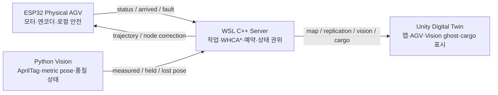
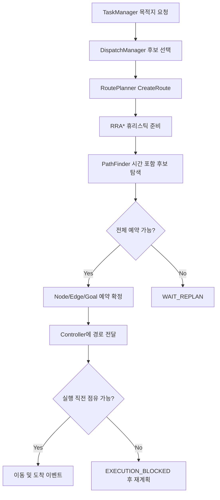
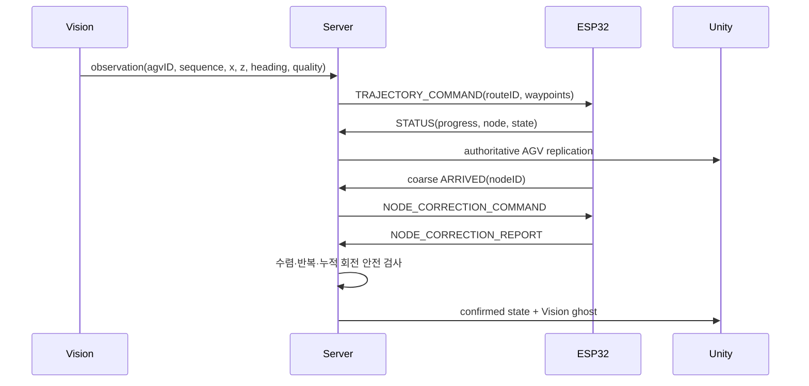
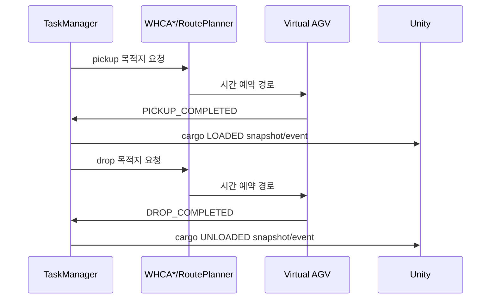

# SmartFactory AGV Digital Twin 기술 기록

Last reviewed: 2026-09-07

이 문서는 이력서 문장이나 포트폴리오 완성본이 아니다. 이후 결과물을 작성할 때 과장 없이 인용할 수 있도록 프로젝트의 문제, 설계 판단, 구현, 검증 근거와 한계를 한곳에 모은 기술 기록이다.

## 1. 프로젝트 목표

하나의 C++ Server가 실제 ESP32 AGV와 Unity 가상 AGV를 같은 작업·경로·예약 모델로 관리하고, Vision이 측정한 물리 pose를 Unity Digital Twin과 실차 도착 보정에 연결하는 것이 목표였다.

핵심은 각 프로그램이 독립적으로 그럴듯하게 동작하는지가 아니라, 송신한 데이터가 다음 시스템에서도 같은 ID, 단위, 좌표와 상태 의미로 해석되는지를 검증하는 것이었다.

## 2. 시스템 책임 경계

| 계층 | 책임 | 책임지지 않는 것 |
|---|---|---|
| C++ Server | world state, 작업 배정, 경로 계획, node/edge/goal 예약, Unity 복제, 실차 보정 정책 | PWM과 즉시 E-stop |
| ESP32 | 명령 검증, 로컬 motion, encoder feedback, 안전 정지, STATUS/ARRIVED/ERROR | 전역 작업 배정과 다중 AGV 예약 |
| Vision | AprilTag 검출, calibration, mm pose, 측정 품질 상태 | 경로 계획과 모터 직접 제어 |
| Unity | Server state 시각화, 계획 pose와 Vision pose 비교, cargo 표현 | authoritative AGV state와 경로 결정 |

이 경계 덕분에 Unity 시뮬레이터와 실제 ESP32가 서로 다른 실행체이면서도 `IRobotController` 뒤에서 동일한 Server 계획 흐름을 사용할 수 있었다.

## 3. 주요 기술 결과

### 3.1 Server-authoritative 다중 AGV 경로 계획

- WHCA*를 기반으로 시간 구간형 node/edge/goal reservation을 구현했다.
- RRA* 기반 정적 휴리스틱과 시간·예약을 포함한 PathFinder를 분리했다.
- PathFinder는 후보만 만들고 RoutePlanner가 전체 경로를 검사한 뒤 transaction처럼 예약을 확정한다.
- 미래 예약과 실제 실행 점유를 `ReservationTable`과 `OccupancyProvider`로 분리했다.
- 실행 직전 점유 실패는 `EXECUTION_BLOCKED` 이벤트와 재계획으로 연결했다.
- 최신 AutomaticFleet 작업에서는 긴 연속 WAIT에 soft penalty를 주고, 상·하차 목적지의 실제 도착 시각 가용성을 반영하는 방향까지 확장했다.

### 3.2 실제 ESP32 AGV의 안전한 실행 계층

- BOOT 승인과 5초 countdown 이전에는 네트워크와 모터 실행을 제한했다.
- default/locked/live/diagnostic/calibration을 분리한 14개 PlatformIO profile로 잘못된 firmware 업로드 위험을 줄였다.
- PWM zero, STBY LOW, disconnect stop, E-stop latch, wrong-direction, stall, timeout, overrun, wheel mismatch, settling, ARRIVED gating을 유지했다.
- trajectory의 LINE과 `ROTATE_IN_PLACE`를 encoder 목표로 실행하고, 실제 node에서만 ARRIVED를 보고하도록 구성했다.
- correction 전용 저속 profile, 좌우 encoder rate synchronization, turn coast 보상과 상세 진단 로그를 추가했다.
- 모터 채널 A/B와 encoder L/R을 분리 시험해 물리 배선과 software mapping을 확인했다.

### 3.3 Vision metric pose와 품질 계약

- AprilTag 기준점과 planar homography로 pixel 좌표를 Server mm 좌표로 변환했다.
- calibration ID, map contract ID, pose contract ID를 사용해 오래되거나 좌표 의미가 다른 calibration을 거부했다.
- 태그 중심이 아니라 실제 바퀴축 중심을 보고하도록 body-frame offset을 적용했다.
- 측정을 `MEASURED`, 짧은 유지 상태 `HELD`, 사용할 수 없는 `LOST`로 구분했다.
- Server correction은 새로운 `MEASURED + VERIFIED`만 제어 근거로 사용하고, Unity는 상태별 색상의 별도 ghost로 표시한다.
- 카메라 이동, 기준 태그 배치 변경, tag 크기와 차체 offset 변경 때마다 calibration을 다시 생성하고 검증했다.

### 3.4 Unity Digital Twin과 물류 상태 표현

- Server의 map/object replication을 받아 AGV 위치와 경로를 렌더링했다.
- authoritative AGV와 Vision ghost를 분리해 계획 위치와 실측 위치 차이를 눈으로 확인할 수 있게 했다.
- Vision packet의 크기, ID, sequence, state/pose 일관성과 finite 값을 검증한다.
- Server의 `UPT_CARGO_STATE`를 받아 task/cargo/AGV별 상차 상태를 복원한다.
- 상차 시 cargo를 AGV의 `CargoMount` 자식으로 즉시 붙이고, 하차 시 해당 cargo만 제거한다.
- sequence와 현재 task/cargo를 확인해 중복 packet과 재접속 snapshot을 idempotent하게 처리한다.

## 4. 핵심 데이터 흐름

### 4.1 실제 주행과 도착 보정

### 4.2 가상 물류 작업

## 5. 실제로 어려웠던 문제와 해결 과정

| 증상 | 최초로 잘못된 지점 | 원인 | 해결 또는 판단 |
|---|---|---|---|
| BOOT를 눌러도 출발하지 않음 | ESP32 TCP connect | 재부팅 후 WSL IP 변경 또는 Windows portproxy listener 불일치 | Server listener, WSL IP, Windows portproxy, 방화벽, ESP32 목적지 IP를 계층별로 확인 |
| 모터가 전혀 돌지 않음 | motor driver 전원 | TB6612 VCC 또는 buck converter/배터리 배선 이탈 | software 변경 전에 VM/VCC/5V/GND와 실제 전압을 분리 점검 |
| 첫 edge 전에 SAFE STOP | Server correction dispatch | 아직 trajectory를 보내지 않아 최초 routeID가 0인데 PRE_DEPARTURE correction이 먼저 실행됨 | 최초 출발은 fresh Vision pose로 Node 1/heading을 검증한 뒤 correction 없이 정상 trajectory routeID를 발급 |
| 회전 중 여러 번 돌다가 정지 | Server correction policy | 위치 오차를 줄이려는 point-turn이 slip으로 새 오차를 만들고 correction budget을 소진 | 위치·heading 오차 분리, hysteresis, 수렴성·반복 방향·누적 회전 guard 추가 |
| 반쯤 돌고 ESP32 ERROR | ESP32 motion fault | 좌우 채널/encoder mismatch 또는 불안정한 전원·배선 | 채널 A/B 300 ms 격리 profile과 WHEEL_MISMATCH 상세 로그로 hardware/software mapping 분리 |
| 직진이 대각선으로 흐름 | physical motion | 우측 하중, 초기 feed-forward 차이, 바닥 마찰과 encoder count만으로는 알 수 없는 lateral slip | 하중 재배치, 동일 target, interval/cumulative encoder sync, counts/mm 재보정; Vision은 node 보정에 한정 |
| 회전 중 Vision이 깜빡이거나 LOST | Vision detection | tag 가림, motion blur, 화면 경계, tag 크기 부족 | 품질 상태를 명시하고 LOST를 제어에 재사용하지 않음; tag 확대와 시야/조명 개선 |
| 카메라를 건드린 뒤 좌표가 어긋남 | calibration | 이전 homography가 새 카메라 자세와 불일치 | calibration ID를 새로 만들고 5개 기준 태그 RMS/max error로 재검증 |
| calibration RMS는 작은데 차체 원점이 노드와 어긋남 | pose transform | anchor fitting과 tag-to-axle offset 정확도는 별개 | raw tag center와 최종 axle center를 함께 기록하고 회전 샘플로 body offset 진단 |
| 실차 중단 원인을 Server만 보고 오판할 위험 | cross-system observation | Vision accepted 로그와 ESP32 motion fault는 독립 신호 | ESP32→Server→Unity 흐름에서 첫 오류 상태를 찾고 전원·배선과 protocol을 함께 대조 |

## 6. 중요한 설계 판단

### Vision으로 주행 중 계속 조향하지 않은 이유

현재 카메라는 occlusion, motion blur, tag 경계 이탈과 렌즈 왜곡의 영향을 받는다. 이 측정을 매 frame 모터 조향에 직접 연결하면 오래된 `HELD` pose나 순간적인 heading noise가 진동을 만들 수 있다. 따라서 현재 구조는 encoder 기반 로컬 motion을 유지하고 node 경계에서 Vision correction을 수행하는 절충안이다.

### Protocol을 증상마다 바꾸지 않은 이유

Server와 ESP32의 routeID, commandID, nodeID와 완료 상태는 안전 상태 전이의 일부다. 예를 들어 최초 routeID 0 문제를 검사 제거로 숨기면 반대쪽 validation과 correction 수명주기가 깨진다. 송·수신 양쪽 의미를 대조하고 기존 packet으로 해결 가능한 경우 protocol layout을 유지했다.

### 실차와 대규모 WHCA 시연을 분리하는 이유

실물 로봇은 한 대이고 물리 정확도와 시야가 제한적이다. 따라서 포트폴리오 시연은 두 증거를 조합하는 것이 정직하고 효과적이다.

1. AutomaticFleet + FactoryMap: 다중 가상 AGV의 WHCA*, 예약, 상·하차를 보여준다.
2. PhysicalFleet + Vision: 동일 Server가 실제 ESP32 AGV를 명령하고 측정 pose를 Unity에 반영함을 보여준다.

현재 코드가 두 경로를 모두 포함하지만, 한 화면에서 실제 1대와 다수 가상 AGV를 동시에 안전하게 운용하는 hybrid demo는 별도 통합 검증 대상이다.

## 7. 검증 근거

| 영역 | 확인된 근거 | 해석 |
|---|---|---|
| Server | 2026-09-07 현재 local WHCA/cargo 작업 포함 CMake build 및 CTest 9/9 PASS | 정책·serializer·state 단위 회귀 검사 통과 |
| ESP32 | 2026-09-07 host tests 5/5 PASS, 14개 compile-time profile, channel A/B 및 90도 CCW 격리 로그 | state machine과 개별 motion primitive 근거 |
| Vision | 전체 offline suite 92개 테스트 PASS, 여러 calibration에서 5/5 anchor 검증 | 좌표·quality·packet logic의 offline 근거 |
| Physical E2E | Server route 수신, BOOT/countdown, encoder motion, STATUS/ARRIVED, Unity 진행 표시를 실제 장치로 관찰 | 단일 로봇 통합 경로가 실제로 동작함 |
| Unity | map/AGV replication, Vision ghost, cargo state source 구현 | 최종 FactoryMap 장시간 시연은 별도 확인 필요 |

테스트 통과는 물리 정확도를 보장하지 않는다. 특히 바닥 마찰, 배터리 전압, 하중 배치, 카메라 가림은 software unit test 밖의 변수다.

## 8. 잘한 점

- 증상만 수정하지 않고 ESP32→TCP→Server→Vision→Unity 데이터 흐름에서 최초 오류를 찾는 방식을 유지했다.
- 안전장치를 디버깅 편의를 위해 제거하지 않고 locked/live/diagnostic profile로 시험 범위를 분리했다.
- 계획 상태, 실제 점유, 실측 pose와 시각화 pose를 서로 다른 개념으로 유지했다.
- calibration RMS와 실제 차체 원점 정확도를 같은 것으로 취급하지 않았다.
- 물리 시험에서 확인한 사실과 코드/단위 테스트만 통과한 사실을 문서에서 분리했다.
- 한 번에 전체를 재작성하기보다 route bootstrap, correction convergence, wheel mismatch처럼 원인을 좁혀 최소 변경했다.

## 9. 아쉬운 점과 개선 방향

- 실물 AGV가 한 대라 실제 다중 로봇 충돌 회피는 Unity simulation으로만 보여줄 수 있다.
- 카메라 intrinsic과 lens distortion 보정이 완전한 전 구역 절대 정확도로 검증되지 않았다.
- encoder만으로 lateral slip을 직접 관측할 수 없어 직진 정확도에 기계적 하중과 바닥 조건의 영향이 남는다.
- Windows 재부팅 후 WSL 주소/portproxy를 수동 복구하는 운영 부담이 있었다. 실행 전 진단 스크립트로 자동화할 여지가 있다.
- 실제 주행 실험의 pose·encoder·Server 로그를 공통 run ID와 timestamp로 자동 수집하지 못해 일부 원인 분석이 수동이었다.
- commit message가 임시 문자열인 이력이 있어 최종 공개 전 tag/release note로 의미 있는 milestone을 다시 묶을 필요가 있다.
- FactoryMap의 대규모 WHCA/cargo 시연은 scene 설정과 장시간 안정성을 최종 검증해야 한다.

## 10. 현재 한계와 주장 경계

포트폴리오에서 말해도 되는 것:

- Server-authoritative C++ 다중 AGV 경로·예약 구조를 구현했다.
- Unity 가상 AGV와 실제 ESP32를 controller abstraction으로 연결했다.
- AprilTag Vision pose를 metric 좌표와 quality state로 Server/Unity에 통합했다.
- 실제 로봇에서 route 수신, 안전 승인, encoder motion, 상태 보고와 node 보정을 반복 디버깅했다.
- 가상 AGV의 cargo 상·하차 상태를 Unity에 복제하는 protocol과 idempotent rendering을 구현했다.

아직 단정하면 안 되는 것:

- 여러 실물 AGV의 WHCA* 충돌 회피를 검증했다.
- 전체 맵에서 centimeter 이하 위치 정확도를 보장한다.
- 어떤 조명·배터리·바닥 조건에서도 무인 장시간 운전한다.
- hybrid physical+virtual fleet가 최종 시연 환경에서 완전히 검증됐다.

## 11. 포트폴리오 자료로 남길 증거

- FactoryMap 전체 화면과 20대 이상 가상 AGV 경로/대기 장면
- 교차로에서 node/edge reservation으로 양보하는 장면
- 박스가 AGV에 상차되고 목적지에서 하차되는 장면
- 실제 ESP32가 BOOT/countdown 후 Server 경로를 수행하는 짧은 영상
- Unity의 authoritative AGV와 cyan/yellow Vision ghost 비교 화면
- Server의 route, reservation, cargo, correction 로그
- ESP32의 encoder/PWM/settling/ARRIVED 진단 로그
- Vision의 calibration 5/5, RMS/max error, MEASURED/HELD/LOST 화면

## 12. 이후 Velog 심화 주제 후보

이 문서는 게시글 초안이 아니다. 이후 다음 주제를 각각 독립 글로 확장할 수 있다.

1. WHCA*를 TimeInterval node/edge/goal reservation으로 확장한 이유
2. 계획 예약과 실행 점유를 분리해 race condition을 막는 방법
3. ESP32 물리 AGV에서 안전 state machine과 ARRIVED gating 설계
4. encoder가 맞아도 로봇이 대각선으로 가는 이유와 lateral slip 분석
5. AprilTag homography의 작은 RMS가 전체 맵 정확도를 보장하지 않는 이유
6. tag center를 바퀴축 중심 pose로 변환하는 body-frame offset
7. WSL Server를 LAN의 ESP32와 연결할 때 portproxy가 필요한 이유
8. routeID 0 bootstrap과 correction lifecycle에서 배운 protocol state 설계
9. Server cargo snapshot과 Unity idempotent event 처리

## 13. 저장소별 상세 기록

- Unity: [UNITY_ENGINEERING_RECORD.md](UNITY_ENGINEERING_RECORD.md)
- Server: Server 저장소 `docs/engineering-retrospective.md`
- ESP32: ESP32 저장소 `docs/engineering-record.md`
- Vision: Vision 저장소 `docs/engineering-record.md`

## 14. 문서 시점의 저장소 상태

- Unity HEAD: `469cd10`; FactoryMap 관련 scene/map 변경은 working tree에서 진행 중이다.
- Server HEAD: `0f765d1`; WHCA wait/dispatch/map 관련 변경은 working tree에서 진행 중이며 이 문서 작성 전 CTest 9/9를 통과했다.
- ESP32 HEAD: `351a1cf`; working tree clean 상태에서 시작했다.
- Vision HEAD: `1e32aba`; 실행 로그는 추적하지 않은 채 보존했다.

이 snapshot은 release tag가 아니다. 최종 공개 전 각 저장소의 commit, build, scene과 실제 demo 결과를 다시 고정해야 한다.
