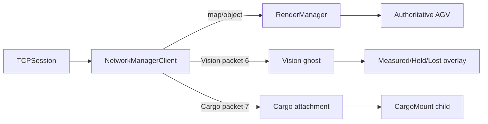

# Unity Digital Twin engineering record

Last reviewed: 2026-09-07

## 역할

Unity는 경로 계획의 권위가 아니라 C++ Server가 가진 world state의 viewer다. Server가 전송한 map과 network object를 렌더링하고, 실제 AGV의 계획 pose와 Vision 측정 pose를 분리해서 보여준다.

## 구현한 내용

### Server replication viewer

- legacy Unity TCP session의 HELLO, map, create/update/destroy 흐름을 유지했다.
- AGV prefab을 network ID로 등록하고 Server update를 Unity x/z 위치로 반영한다.
- `RT_UPDATE`가 `RT_CREATE`보다 먼저 오는 잘못된 순서를 거부해 조용한 상태 오염을 막는다.
- 연결과 session 종료 시 viewer-side 상태를 정리한다.

### Vision ghost

- packet type 6의 Vision observation을 별도 parser로 처리한다.
- payload size, AGV ID, sequence, tracking state, pose-valid 조합, finite pose와 trailing byte를 검증한다.
- authoritative AGV와 별도의 `Vision_AGV_[id]`를 생성한다.
- `MEASURED`는 cyan, `HELD`는 yellow로 표시하고 `LOST`는 숨긴다.
- renderer material을 instance로 복제해 ghost 색상 변경이 원본 prefab이나 계획 AGV에 전파되지 않게 했다.

### Cargo state visualization

- Server packet type 7을 `CargoStatePacket`으로 역직렬화한다.
- `agvID`, `taskID`, `cargoID`, `nodeID`, `sequence`, load state를 사용한다.
- LOADED는 선택된 cargo prefab을 `CargoMount` 아래에 즉시 생성해 AGV와 함께 이동시킨다.
- UNLOADED는 현재 task/cargo가 일치하는 instance만 제거한다.
- AGV가 생성되기 전에 cargo snapshot이 오면 pending 상태로 보관했다가 create 이후 적용한다.
- AGV별 마지막 sequence와 현재 task/cargo를 확인해 중복/역순 packet을 idempotent하게 처리한다.
- 재접속 시 session 상태를 초기화하고 Server snapshot으로 복원할 수 있다.

## 주요 문제와 해결

| 문제 | 원인 | 해결 |
|---|---|---|
| Unity AGV가 멈춰 보임 | Unity 자체가 아니라 Server가 다음 상태를 보내지 않거나 ESP32가 fault를 보고한 경우가 있었음 | Unity부터 수정하지 않고 Server/ESP32 로그까지 data flow 추적 |
| 계획 AGV와 실차 위치 차이를 판단하기 어려움 | 하나의 object에 두 pose 의미를 섞을 수 있음 | authoritative AGV와 Vision ghost를 분리 |
| Vision LOST 이후 오래된 위치가 실제처럼 남음 | 마지막 pose를 계속 표시하면 freshness 의미가 사라짐 | LOST는 숨기고 HELD를 별도 색상으로 표현 |
| cargo event가 AGV create보다 먼저 도착 | network event 순서와 scene object lifetime 차이 | pending cargo state 저장 후 AGV create 시 적용 |
| 중복 상차로 박스가 여러 개 생길 수 있음 | 재연결 snapshot과 event 재전송 | sequence와 task/cargo identity로 중복 방지 |
| Unity 연결 거부 | viewer endpoint에 Server listener가 없거나 WSL forwarding이 달라짐 | Unity code 문제와 network listener 문제를 분리 진단 |

## 좌표와 상태 계약

- Unity는 Server map unit을 그대로 scene x/z에 매핑하는 기존 계약을 따른다.
- Vision의 mm→map unit 변환은 Server가 수행하고 Unity는 packet 의미를 다시 해석하지 않는다.
- Unity object transform은 표시 결과이며 Server state를 역으로 수정하지 않는다.
- cargo GameObject 이름은 protocol에 넣지 않는다. Server의 stable cargo ID를 Unity prefab 배열에 매핑한다.

## 검증과 증거

- 실제 physical demo에서 Server가 생성한 AGV 1과 STATUS 기반 이동을 Unity에서 관찰했다.
- Vision observation parser와 ghost state 전환 코드는 strict validation을 포함한다.
- cargo LOADED/UNLOADED, pending create, duplicate sequence와 session reset 경로가 구현돼 있다.
- 현재 FactoryMap/scene 설정은 working tree에서 조정 중이므로 최종 포트폴리오 장면은 Unity Editor에서 다시 검증해야 한다.

## 한계

- Unity는 collision avoidance 결과를 보여주지만 WHCA*를 계산하지 않는다.
- 현재 cargo는 시각 표현이며 물리, 적재 용량, animation을 모델링하지 않는다.
- scene에 지정한 prefab/mount 높이와 실제 박스 출발 위치 연결은 최종 Inspector 검증이 필요하다.
- physical 1대와 virtual fleet를 동시에 보여주는 hybrid mode는 Server 실행 계약까지 포함해 별도 검증해야 한다.

## 포트폴리오에서 강조할 수 있는 기술

- TCP binary protocol의 defensive deserialization
- Server-authoritative replication과 Unity object lifecycle 관리
- planned state와 measured state를 분리한 digital-twin visualization
- sequence 기반 idempotent cargo event/snapshot 처리
- network state와 GameObject lifetime 순서 차이를 흡수하는 pending-state 설계

전체 시스템 맥락은 [SMART_FACTORY_AGV_PROJECT_RECORD.md](SMART_FACTORY_AGV_PROJECT_RECORD.md)를 참고한다.
